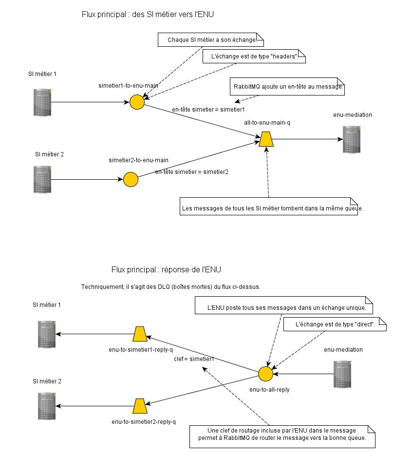

# Organisation des queues RabbitMQ

## Échanges et queues RabbitMQ

Le diagramme ci-dessous résume la configuration utilisées pour tous les messages.

## Sécurité

### Confidentialité

La confidentialité des échanges de messages est un aspect important de la configuration :
il faut par exemple garantir que les données fiscales des citoyens intégrées dans
des messages produits par un SI de l'administration fiscale ne puissent jamais
être vues par un autre SI métier.
Cette confidentialité est obtenue en créant un échange RabbitMQ par SI métier,
avec accès gardé par TLS (SSL).
Chaque SI métier ne peut donc voir que "son" échange RabbitMQ. 

### Authenticité

L'application `enu-mediation`, consommatrice de la plupart des messages RabbitMQ,
doit garantir que tout message provient bien du SI métier attendu.
Or le cloisonnement des échanges RabbitMQ et l'utilisation de TLS ne garantissent
pas cette authenticité.
En effet, rien n'empêche à ce stade un SI métier d'envoyer dans son échange RabbitMQ
un message dont le champ `idPrestation` indique une prestation d'un autre
SI métier.
Par exemple, un SI métier de la santé pourrait produire un message de taxation d'impôts.
Pour éviter ce genre d'incident, l'application `enu-mediation` possède une liste
des prestations possibles pour chaque SI métier.
Lors de la consommation d'un message, l'application `enu-mediation` confronte
la valeur de `idPrestation` du message avec cette liste.
