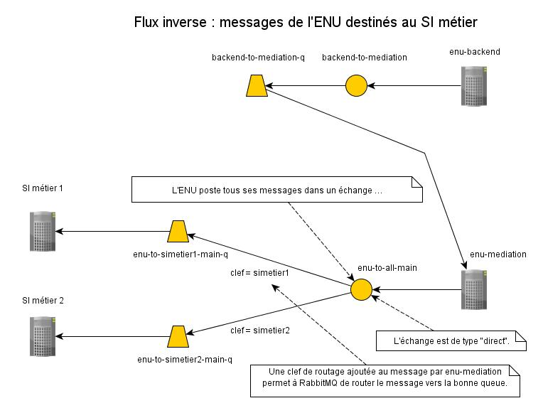

# Organisation des queues RabbitMQ

## Échanges et queues RabbitMQ

### Flux principal

Le diagramme ci-dessous résume la configuration RabbitMQ utilisée pour le flux principal.
Par "flux principal", on entend les échanges de messages à l'initiative d'un SI métier.
Exemples :
un message de création d'une démarche,
un message d'ajout d'un document à une démarche existante.

Avoir une seule queue `all-to-enu-main-q` pour tous les messages est précieux :
tant la programmation de `enu-mediation` que sa configuration sont simplifiés.
En particulier, l'ajout d'une nouvelle prestation ou d'un nouveau SI métier ne nécessite
aucun développement dans `enu-mediation`, tout se jouant dans les paramètres de déploiement.

### Flux inverse

Le diagramme ci-dessous résume la configuration RabbitMQ utilisée pour le flux inverse.
Par "flux inverse", on entend les échanges de messages à l'initiative de l'ENU.
Exemples :
un message de notification de destruction par l'usager d'un brouillon de démarche,
un message de notification de la consultation d'un document par l'usager.

L'application `backend-end`, qui grosso modo est FormServices, ne connaît pas la notion
de SI métier : en tant que serveur de formulaire, elle ne connaît que les prestations.
Il en découle un traitement en deux phases, alors que le flux principal ne nécessite
qu'une seule phase :
- phase 1 : envoi du message de `enu-backend` à RabbitMQ
- phase 2 : consommation du message par `enu-mediation` qui, en mode passe-plat, renvoie
le message inchangé vers la queue `enu-to-all-main`, mais avec une clef de routage
désignant le SI métier cible.
  
Ce flux est très semblable à la partie "réponse" du flux principal ;
on aurait même pu simplement en réutiser les échanges et les queues.
Cependant, créer un jeu séparé d'échanges et de queues permet au SI métier d'avoir deux
queues, aux propos distincts, c'est-à-dire ne mêlant pas les notifications de `enu-backend`
aux réponses de `enu-mediation`.

La communication entre `enu-backend` et `enu-mediation` aurait pu éviter RabbitMQ et se faire
de façon directe, via des appels de services REST.
Cependant l'utilisation de RabbitMQ permet à `enu-backend` d'être sûre du traitement du message,
même si `enu-mediation` est arrêtée ;
sans cela, il aurait fallu trouver un moyen de mettre les messages en attente du côté de
`enu-backend`.

Pour l'instant, on ne considère pas de messages de réponse, ni de boîte aux lettres morte,
dans le flux inverse.

## Sécurité

### Confidentialité

La confidentialité des échanges de messages est un aspect important de la configuration :
il faut par exemple garantir que les données fiscales des citoyens intégrées dans
des messages produits par un SI de l'administration fiscale ne puissent jamais
être vues par un autre SI métier.
Cette confidentialité est obtenue en créant un échange RabbitMQ pour chaque SI métier,
avec accès gardé par TLS (SSL).
Chaque SI métier ne peut donc voir que "son" échange RabbitMQ. 

### Droits d'accès

L'application `enu-mediation`, consommatrice de la plupart des messages RabbitMQ,
doit garantir que tout message provient bien du SI métier attendu.
Or le cloisonnement des échanges RabbitMQ et l'utilisation de TLS ne garantissent
pas cette authenticité.
En effet, rien n'empêche à ce stade un SI métier d'envoyer dans son propre échange RabbitMQ
un message dont le champ `idPrestation` indique une prestation d'un autre
SI métier ;
par exemple, un SI métier de la santé pourrait produire un message de taxation d'impôts.
Pour éviter ce genre d'incident, on a muni l'application `enu-mediation` d'une liste
des prestations possibles pour chaque SI métier.
Lors de la consommation d'un message, l'application `enu-mediation` confronte
la valeur de `idPrestation` du message avec cette liste et, le cas échéant, émet une réponse
d'erreur.
