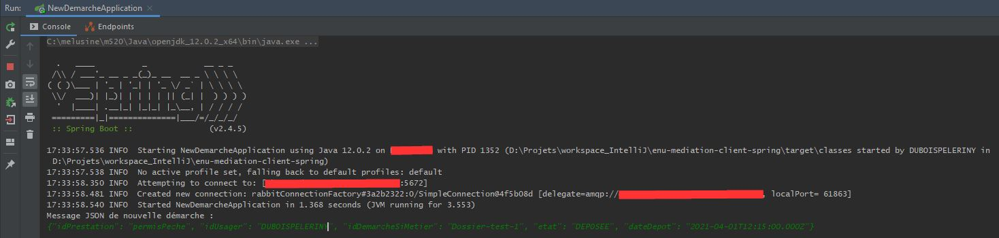
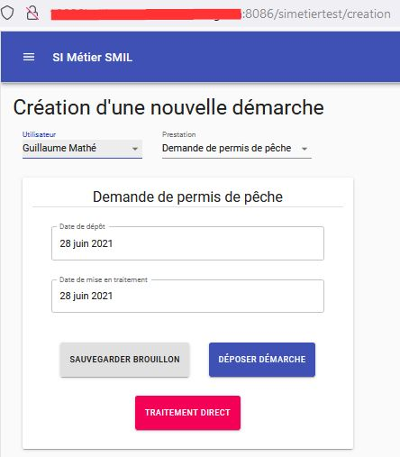

# Test

Pour tester la chaîne de traitement composée de `enu-mediation` et de `enu-backend`, deux outils 
fonctionnellement à peu près équivalents sont proposés :
le faux SI métier technique et le faux SI métier graphique.

Ces deux outils fonctionnent par envois de messages JSON dans une queue RabbitMQ.
Il permettent donc l'un et l'autre de tester la chaîne complète de création de données :

```application cliente -> RabbitMQ -> enu-mediation -> enu-backend```

où le maillon enu-backend comprend notamment le stockage en GED et le stockage en base de données. 

## Le faux SI métier technique

Le faux SI métier technique est une simple application Java sans interface utilisateur.
Son usager-type est un développeur de enu-mediation ou un développeur d'un SI métier
devant interfacer son système avec l'Espace numérique de l'usager, via RabbitMQ.
Les messages JSON y sont explicites.
Il en existe deux versions équivalentes :
- `enu-mediation-client-camel` : la communication avec RabbitMQ se fait via Apache Camel.
  Cette version n'est plus maintenue à partir de mai 2021.
- `enu-mediation-client-spring` : la communication avec RabbitMQ se fait via Spring RabbitMQ.



## Le faux SI métier graphique

Le faux SI métier graphique (`enu-si-metier`) est une petite application écrite en HTML 5 et en Java
qui permet, via une interface utilisateur minimale, de créer des données.
Ton usager-type est un analyste métier ou un testeur fonctionnel.
Les messages JSON sont cachés à l'utilisateur.


